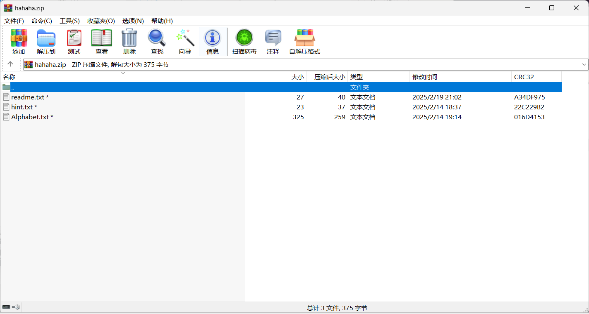
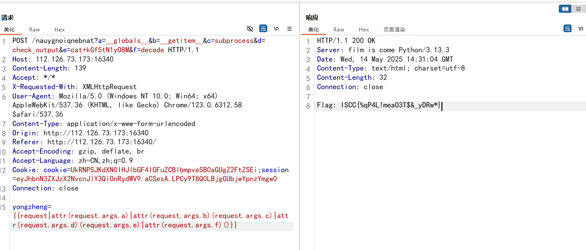
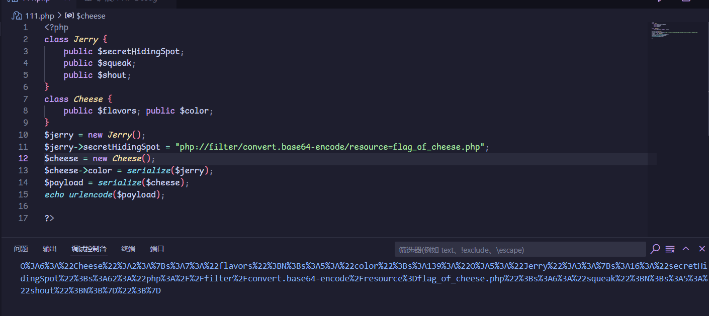
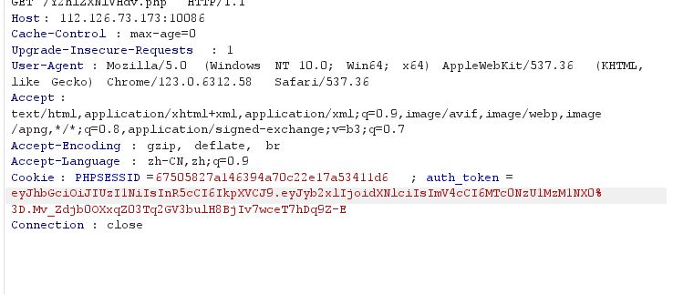

# MISC

## 黑白有常，虹色寻异

根据`hint1`：计算机所展示出来的图片并非全貌，每一个通道不止8位，考虑提取出来所有通道的图片查看

可以得到三个压缩包的密码，分别为 `I@mGr33N, ReDDD_1z_G00d, A_B1u3_K3YYY?!`，分别对应zip2, zip1, zip3，结合题目描述，这应该和之后用音频生成图片有关。

`Audacity`打开，发现应该是01串

按照题目描述，`406×228*8=92568*8=740544`

音频时长

除一下 `（2*3600+180+25）/740544=0.0099994`，大约当作0.001秒采样就行，wave和颜色对应关系应该就是解压密码对应关系

根据`hint2`，最初的文件名可以和某一段key进行某种运算，`sKJDh-xV_hr-daX`

做异或，解压rar，直接解压只有一半

根据`hint3`，为什么最后一段压缩包要用rar压缩，在二进制中或许有信息，考虑`NTFS`数据流隐写

使用winrar的高级选项

查看stream，发现存在`ADS`

得到后半段flag

合起来：

`ISCC{Y0u_KN0ww_C0!OuR_@nd_B1n@RY!!!}`

## 签个到吧

附件是一个`flag_is_not_here.jpg`二维码和`hint29.zip`，里面是个扭曲的类似二维码的图片，010看了一下没啥特殊的，也没藏啥东西，那就分析`0001_29.png`吧

`Solvstege`打开，`alpha0`通道有问题

试了一会儿找到了隐写

的确是类似的变换

找了个脚本还原，如图

类似二维码，但又不是，但是图片大小也是`400*400`，或许可以考虑做异或，先反色处理并转正

和一开始的jpg做异或

的确出现了一个新的二维码

扫描得到flag

 

## 取证分析

附件是一个`word`，等网盘的附件下载的时候先看看这个word，翻了一下好像真没啥隐藏的信息，后缀改成zip翻翻看。

发现在`[Content_Types].xml`后面有个注释，先记住。

网盘的文件终于下好了，一看是个`vmem`，用vol2分析。

`Cmdscan`发现有个`hahaha.zip`，比较可疑。`Filedump`出来分析。

但是发现是加密的

里面有三个文件，不是伪加密，那密码要么取证，要么其他方法了。然后突然对上了脑电波，word的文字内容还没用过呢，复制粘贴到txt里，发现crc和readme.txt一样，那就是明文攻击了，把txt打包成压缩包，放进APCHRP开始爆，暴了好久，终于爆出了结果

解压出来看另外两个文件，hint.txt用凯撒解出来是`flag{ vigenere cipher }`，提示维吉尼亚

另外一个是杨辉三角，这真的是嗯对脑电波的，烂，一点提示都没有，最后嗯找对上的

计算每组数（列，行）对应值，对26取模后转字母，作为密钥去解密之前xml文件后的注释，套上ISCC就是flag了。

## 睡美人&正正得负&返校之路&蛇壳的秘密

期间电脑坏了一次，系统盘寄掉了，修完重装系统发现这几个word都损坏了，附件也删掉了没法复现，那就这样吧

返校之路好像是一血

# WEB

## 十八铜人阵

打开页面，是要提交，先不着急，F12看看源码先

有很多佛曰加密

挨个解开看看

继续看源码

有个display的组件，展示出来，多了一个输入框，还有一个路由，但目前无法访问

但是提交说我错误

回头看源码，发现参数很奇怪，`aGnsEweTr6`，是在answer6中间塞了个GET，推测最后一个答案要用get传，bp打开

拿到一个通关的session，现在拿着这个session去访问之前F12看到的路由

给了一串字符，不知道有什么用，先记着，`kGf5tN1yO8M`

之前注意到该路由是听声辩位拼音倒过来，所以猜测第二关是探本求源倒过来

成功访问，同时看见源码

无回显的`SSTI`，那推测之前的字符串应该是存放flag的文件

好像没啥过滤，很轻松就能打通

得到flag

# 谁动了我的奶酪

一进来要提交答案，F12翻了一下没发现有用的东西，输入`TOM`尝试一下

结果的确是`tom`

注意了一下网页名

B64解码是`cheeseone`，之后可能有用。

看了一下，要先利用clue得到存放flag的位置(where)，再利用`cheese_tracker`泄露flag内容。

不得不说我们的大d老师的确很强力

这个payload直接粘贴过去就能成功打通

flag在`flag_of_cheese.php`里，不过另一个利用d老师就不太行了，还是得手动构造。

Cheese_tracker反序列化可以触发Cheese Class的`\_\_destruct`方法，会反序列化$this->color，可以把color构造成一个`Jerry Class`，这样就会触发__invoke方法，这会调用`searchForCheese($this->secretHidingSpot)`，而$this->secretHidingSpot可以构造成为协议来读取输出`flag_of_cheese.php`

只得到了一半的flag和一串提示，`ISCC{ch33se_th!ef_!5_the`，Jerry还听到别的鼠鼠说Tom用22的16进制异或什么的...

想起来直接解码出来的`cheeseone`，访问一下`cheesetwo`或者b64编码试试，成功访问到

 

F12

先记下来  `DEBUG: SmVycnlfTG92ZXNfQ2hlZXNl` 

bp开起来看一下，有`auth_token`

`JWT`解一下

发现`role`是`user`，改成`admin`试试，用Jerry_Loves_Cheese加密

 

修改session

刷新一下

访问

和之前说的`22`的十六进制做异或

和之前的一半flag拼接，得到完整flag，`ISCC{ch33se_th!ef_!5_the_0n3_beh!no1_the_w@11s}`

 

## 哪吒的试炼&ShallowSeek&回归基本功

哪吒的试炼奇异简单，不过word也损坏了。另外两个也挺简单的，不过是队友写的wp，懒得再写一遍放上来了TAT...