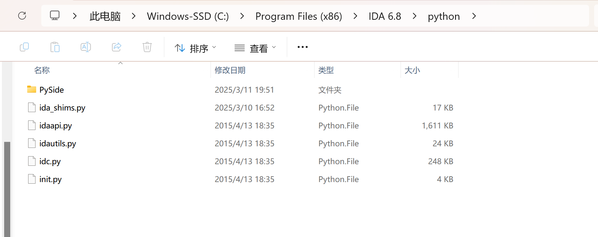
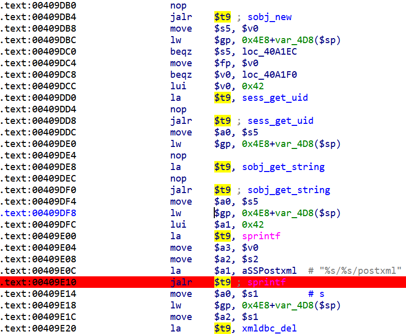
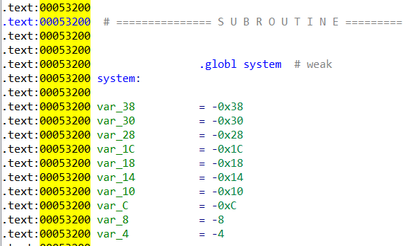

# 环境搭建

实验环境：Ubuntu20.04+qemu4.2,IDA6.8

## 提取固件环境准备

### 安装binwalk

Ubuntu系统直接`sudo apt install binwalk`命令安装即可。


安装完毕后检测是否成功安装，执行binwalk --version指令不知为何将“--version"理解为文件而报错，后续了解到还有另一种办法判断安装情况，即执行binwalk指令后显示版本号即为成功，如上图，binwalk版本号为2.2.0，故此判断应安装成功。后续提取固件也并未出现问题，故为对此报错深究。

### 安装sasquatch

由于提取固件时并未看到教程后面的安装sasquatch部分，因此直接上网搜索下载sasquatch的办法，提供指令如下：

```bash
sudo apt-get install build-essential liblzma-dev liblzo2-dev zlib1g-dev

git clone https://github.com/devttys0/sasquatch.git

cd sasquatch

./build.sh
```

其实与教程指令差别不大，执行指令截图如下：


至此提取固件前准备工作完成。

## IDA6.8关于mips插件

一开始按照教程方案将ida_shims与mipsrop.py文件均放入IDA6.8的plugins文件夹中时，IDA的edit窗口并未如预期展现mips的选项。之后上网查阅资料寻找其他方案，有利用IDA7.0在其plugins文件夹中放入一个支持7.0及以上系统的文件夹，打开后观之，文件中多了一个支持python3的ida_shims文件，不过最终依旧得不到结果。之后在同学帮助下得知，ida_shims文件应该放在IDA的python文件夹下，照做后成功在edit窗口中出现了mips选项，如下图所示：



​                                                             


后续查询原因推测应该是ida_shims是一个模块，它本身并不直接作为插件运行，而是被其他插件或脚本导入使用。因此，将它放在 Python 文件夹下更符合 Python 的模块管理机制。

# 溢出点定位

### IDA6.8

漏洞存在于./htdocs/cgibin中，将cgibin拷贝到物理机中，使用IDA分析，shift+F12打开字符串窗口，搜索“HTTP_COOKIE”。进入sess_get_uid函数（调用“HTTP_COOKIE”字符串位置），继续按X键查看调用信息。



sprintf函数本身没有检查字符串长度相关的参数（snprintf可以指定目标缓存区的最大长度）。

注意到a1是格式化字符串，里面有两个%s，它们分别和a2与a3相对应。这个sprintf函数会把最终结果输出给a0。

查看a2如何定义：

move \$a2,\$s2 往上查找，发现没有直接对s2进行赋值的语句，点击进入函数看看。


sess_get_uid函数：虽然函数开始保存了s2，返回时应该不会改变，但是s2是字符串指针。函数可能改变它存储的内容。


sobj_get_string也没有、cgibin_reatwhite没有、cgibin_parse_request同样没有。

在往上找了将近一百行后，发现有这么一行代码：


回头观察a3：move    \$a3, \$v0


a3是函数的返回值->mov \$a0,\$s5


s5初值为v0，经过sobj_get_string修改最后赋值给a0。

s5由sobj_new初始化，没什么信息，进入sess_get_uid看看......

### IDA9.1：


重点关注v4是如何变成string的。


往下看，函数sess_get_uid改变了v4，并且肯定和cookie有关！


再往下：截断了v4，只取后面的部分。


没找到HTTP_COOKIE的定义......

### 溢出大小确定

`python2.7 ./patternLocOffset.py -c -l 2000 -f dir645_patternLocOffset_test`

这行代码用于生成一个字符串：


输入溢出覆盖RA，接着通过报错时RA寄存器的值即可判断缓冲区大小。

# 库函数基址获取

文档中提供了两种方式来获取库函数的基址，分别为使用使用qemu模拟mips系统和使用qemu的用户模式调试。两种方式的区别在于：前者模拟了mips系统，而后者只模拟了一个mipsel CPU。

## qemu模拟mips系统

使用qemu模拟mips系统需要解决的问题是如何建立Ubuntu与Debian之间的通信，文档中提到了修改/etc/network/interfaces文件和建立网桥两种方法，这里使用建立网桥的方法，根据网上的教程编写脚本如下：

```bash
!/bin/bash

# 检查是否为root用户
if [ "$(id -u)" != "0" ]; then
   echo "此脚本需要root权限，请使用sudo运行" 
   exit 1
fi

# 获取能上网的网卡名称作为参数
if [ $# -eq 0 ]; then
    echo "使用方法: $0 <网卡名称>"
    echo "例如: $0 enp0s5"
    exit 1
fi

INTERFACE=$1
BRIDGE="br0"
TAP="tap0"

# 配置网桥
echo "关闭网卡 $INTERFACE..."
ifconfig $INTERFACE down

echo "创建网桥 $BRIDGE..."
brctl addbr $BRIDGE

echo "将 $INTERFACE 添加到网桥..."
brctl addif $BRIDGE $INTERFACE

echo "配置网桥参数..."
brctl stp $BRIDGE off
brctl setfd $BRIDGE 1
brctl sethello $BRIDGE 1

echo "启用网桥和网卡接口..."
ifconfig $BRIDGE 0.0.0.0 promisc up
ifconfig $INTERFACE 0.0.0.0 promisc up
echo "从DHCP服务器获取IP地址..."
dhclient $BRIDGE

echo "创建TAP设备..."
tunctl -t $TAP -u root
brctl addif $BRIDGE $TAP
ifconfig $TAP 0.0.0.0 promisc up

echo "显示网桥信息..."
brctl show $BRIDGE
brctl showstp $BRIDGE

echo "网桥配置完成!"
echo "网络接口状态:"
ifconfig | grep -A 6 "$BRIDGE\|$INTERFACE\|$TAP"

```

成功建立网桥后，使用如下命令即可进入mips系统

```bash
qemu-system-mipsel -M malta -kernel vmlinux-3.2.0-4-4kc-malta -hda debian_wheezy_mipsel_standard.qcow2  -append "root=/dev/sda1 console=tty0" -nographic -net nic -net tap,ifname=tap0,script=no,downscript=noclear
```

需要注意iframe参数要与网桥接口匹配。在模拟的mips系统中，首先关闭ASLR，并且为网卡设置ip地址，确认能与主机通信后，使用scp命令传输所需的目录文件和gdbserver。使用gdbserver运行cgibin，可以查看到进程pid，ssh连接到mips系统后,运行

```bash
cat /proc/pid/maps
```

即可查看进程内存空间分布，可以看到内存分布中只有ld-uclibc.so.0动态链接库，我们需要的库函数还未加载，因此我们考虑在Ubuntu中使用gdb远程调试，进入main函数中再查看进程内存分布。


在Ubuntu中使用gdb附加后，打断点进入main函数时报错，继续运行程序直接退出。对于这个问题我进行了多方面的分析，但是最后还是未能解决，具体可以查看问题汇总部分。至此，第一种方法未能获取库函数基址，准备转向第二种方法。


## qemu用户模式调试

qemu用户模式关键在于使用qemu-mipsel-static模拟单个mips CPU，进而运行mips架构程序，文档中给出的脚本中的运行命令如下：

暂时无法在飞书文档外展示此内容

在这个部分我遇到了小问题，实验前期我使用binwalk提取出来的路由器固件中，hedwig.cgi->cgibin的软链接丢失，因此我将运行命令中的./htdocs/web/hedwig.cgi改为了./htdocs/cgibin，在没理解REQUEST_URI意义的情况下更改这个参数为cgibin，导致程序在进入main函数之前退出。使用ida单步调试发现程序在进入main函数之前，会逐一对比REQUEST_URI的值，可能的值包括hedwig.cgi，pigwidgeon.cgi等，根据对比的值进入相应函数，更改REQUEST_URI导致程序未能跳转进任何函数，报错unknown command cgibin。

解决上述问题后成功运行，使用gdb远程附加进入main函数，查看程序进程号，使用cat命令查看进程内存分布，结果如下：


可以看到libuClibc-0.9.30.1.so的基址是0x6b30c000，这里的libuClibc-0.9.30.1.so其实就是libc.so.0，使用ls -la查看lib目录可以看到libc.so.0->libuClibc-0.9.30.1.so。但是根据后续实验过程，此处获取到的基址不能实现正确的跳转，访问的地址全为无效地址，可能是由于gdb装载地址与内存空间地址不同。

尝试使用vmmap获取gdb中内存地址分布。但是结果完全不可读：


此时注意到上方的info sharedlibrary命令结果，似乎为库函数基址，对其进行验证。libc.so.0基址显示为0x2b315ce0，使用info functions命令查看程序函数，以后续expliot会使用到的sleep函数为准，sleep函数在ida中的偏移为0x5bd0，因此info function中sleep函数地址应该为0x2b362bd0，info functions命令结果中sleep函数地址确为此，验证成功。


为排除同名函数的可能性，使用x/10i 0x2b315d50命令查看0x2b362bd0 处的10条命令，与ida中对比发现一致，可以确定libc.so.0在gdb中装载地址为0x2b362bd0 。

# ROP链构造

## 偏移地址


gadget at 0x169C4: =>addiu \$s2, \$sp, 0x18;  jalr \$s0


gadget at 0x45988: => addiu \$s0, 1; jalr \$s1



Location of system

## EXP（ system() function ）


首先覆盖寄存器s0的值为system-1的偏移（栈对齐），之后使用gadget1的jalr \$s0跳转到system，然后使用'aaaa'*7覆盖其他寄存器，在gadget2，恢复s0，并跳转到gadget1，接下来填充0x18废数据，保证s2指向cmd字符串（addiu \$s2, \$sp, 0x18）

然而，用这个EXP是打不通的，在system执行时会发生中断。查看指令，发现在从（fp+0x10）处取一个字节给\$gp的时候，fp是空指针，所以会直接报错。分析system代码查看fp指针的来源，发现system中存在fork()，返回值会存在\$v0里面，接下来去运行bgez \$v0, loc_532CC。


查阅网络资料，发现user-mode虽然支持多线程/多进程，但是vCPU只有一个，而之前的system中的fork会导致原子操作冲突了，所以无法fork起一个新线程，就会导致返回值为空，即fp、\$v0为空，就会出错，导致正确的EXP打不通。


现在知道了打不通的原因，并不是EXP的问题，那就只需要换一种不会调用system(或fork)的payload就应该可以打通了，即shellcode。

根据资料采用编写shellcode，调用execve函数获取shell，但是因为mips缓存机制的原因需要将数据写入主存，不能写入数据cache，可以先调用堵塞函数例如sleep函数，然后从它的返回地址入手去执行shellcode。

编写shellcode的过程不说了直接拿网站的shellcode（execve /bin/sh）可以用

rop链流程如图：


在溢出的返回地址里面填入的find找到的一个跳板地址0x00057e50（记作A），（用这个find是为了给sleep一个参数1）,在A中最后会跳转到（s1存放的地址也就是tali（）找到的地址记作）B（这个的作用是为了控制ra因为sleep最后的返回地址不可控）


在B里面跳转到s2那就把sleep地址放到s2，ra在B里面也可以控制偏移0X24处；那sleep返回到哪里呢？


到此理一下逻辑从溢出点返回到A给sleep一个参数，然后在A里面跳转到B（S1）控制sleep的返回地址，接着从B进入sleep(S2),

返回到shellcode的地方所以使用“mipsrop.stackfinder()”命令寻找一个可以存放shellcode的位置


在偏移0x18(0x50+var_38)处是我们的shellcode，存进了shellcode，但是最后会跳入S4，那我们把S4里面的跳转或者返回地址改为S1不就到了shellcode嘛！

还要找一个地址存入S4且它最后返回S1


最后就到shellcode了写出代码：


然后跑.sh程序，使用ida远程连接就OK了。

# 问题汇总

## binwalk提取固件丢失符号链接

在实验开始时，使用binwalk提取路由器dir-645固件后，发现hedwig.cgi->cgibin的符号链接丢失，但是丢失好像只存在于/htdocs/web目录，/lib目录下的符号链接并未丢失。


## GDB调试qemu模拟系统中的进程报错

在获取库函数基址步骤中，直接查看进程内存分布只能看到动态链接库的基址，因此我想在Ubuntu主机中gdb远程附加进程，运行到main函数后再查看进程内存分布，但是如上面描述的，打断点和直接运行都无法进入main函数。


- 根据ldd命令结果，cgibin所需的libc.so.0未找到，这个结果应该是由于当前读取是root目录下的库函数，启动gdbserver时使用的是chroot命令，应该可以找到lib文件夹中的libc.so.0。
- 推测可能是scp传输丢失符号链接的原因，但是尝试过先使用tar压缩目录再传输，结果还是一样。

## vmmap显示的地址不可读

在Ubuntu主机中使用gdb远程附加调试，进入main函数中后运行vmmap命令，显示出来的内存空间不可读。


对于解决这个问题我进行了以下尝试，但都未能解决

- 更改gdb和pwn-gdb版本，使用gdb-peda，使用源码安装gdb而不是Ubuntu工具包
- 关闭主机ASLR
- 强制设置内存地址

查阅资料发现可能是由于vmmap无法识别target remote:/目录，即远程附加进程的库函数，导致无法建立正确的内存映射。但是我未阅读vmmap源码，因此不能确定。

## GDB装载库函数基址与主机进程不同 

实验过程中查看进程内存空间得到的基址为0x6b30c00，而gdb中为0x2b315d50。

我做了以下方面排查：

- 关闭Ubuntu的ASLR
- 连接目标时使用target remote localhost:1234
- 设置gdb强制关闭ASLR，出现了报错：Disabling randomization of debuggee's virtual address space is unsupported on this platform.

## SP变化


为什么sp会变？

暂时无法在飞书文档外展示此内容

## HTTP_COOKIE

已经分析出HTTP_COOKIE是从环境变量里取的，但并未找到在何处输入，输入时有无长度限制。

## Target remote 

按照教程开启远程调试时，出现如下问题：


按照错误提示输入set exception-verbose on命令后，展现出更详细错误提示。根据提示查看程序在内存中的映射情况，结果并没有0x34400000这样一个地址。


于是推测可能是程序错误或者qemu模拟系统架构问题等等，由于不大可能是程序问题，于是检查gdb版本、qemu版本等适配情况，最后注意到调试程序是mipsel小端，而调试指令set arch mips,set endian big将程序设为大端，于是删去这两指令最后错误消失。


# 参考链接
https://bbs.kanxue.com/thread-263758.htm
