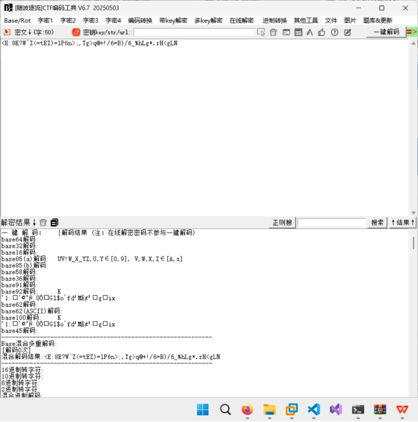
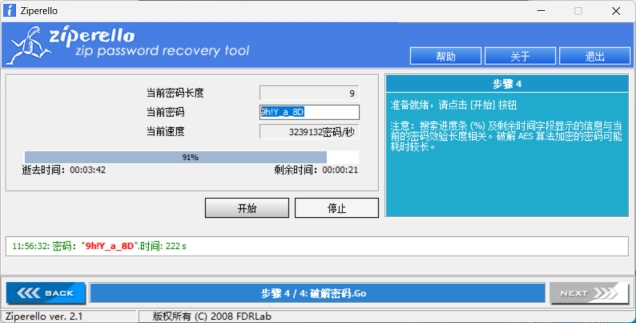
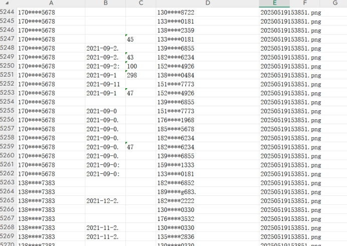

# MISC

## small_challenge

附件zip，里面是个png

 

010打开，发现后面有个zip，拿出来，是flag.zip和2.png

 

2.png和一开始的png很像，尝试异或一下，使用stegsolve的combine异或，得到一个和二维码很像的东西

 

网上搜了一下，发现这东西叫做DM码

 

随波逐流解

 

Base85，应该是压缩包密码的表达式，自己写的脚本有点慢，网上找了个工具

 

解开就是flag

 

 

# PPC

## 01

其实一开始瞪眼就看出来了，但是因为我没有意识到题目渲染了md，把170\*\*\*\*5678和170\*\*\*\*5678中间的\*\*渲染没了，导致我一直以为flag是flag{1705678}格式的，不过也挺合理的吧（

 

用ai搓了个脚本，把图片转化成excel

```python
import cv2
import pytesseract
import pandas as pd
import numpy as np
import os
import re
import glob
from datetime import datetime
import concurrent.futures
import threading

# 开始时间
start_time = datetime.now()
print(f"程序开始执行: {start_time}")

# 线程锁，用于保护共享数据
data_lock = threading.Lock()

# 获取当前目录下的所有PNG文件
png_files = glob.glob('*.png')

if not png_files:
    print("错误：当前目录下没有找到PNG文件!")
    exit(1)

print(f"找到 {len(png_files)} 个PNG文件: {', '.join(png_files)}")

# 定义列位置
columns = [
    {"name": "本方号码", "start": 83, "end": 221},
    {"name": "通讯时间", "start": 999, "end": 1060},
    {"name": "通讯时长", "start": 1080, "end": 1149},
    {"name": "对方号码", "start": 1322, "end": 1428},
]
print(f"共定义了 {len(columns)} 列")

# 行位置设置
header_height = 24  # 标题行高度
row_height = 24     # 数据行高度

# 存储所有文件的数据
all_data = {col["name"]: [] for col in columns}
all_data["来源文件"] = []  # 添加一列记录数据来源的文件名

# 日期和时长的正则表达式模式
date_pattern = re.compile(r'\d{4}[/\-\.年]\d{1,2}[/\-\.月]\d{1,2}\D?\s*\d{1,2}:\d{2}(:\d{2})?')
duration_pattern = re.compile(r'\d{1,2}:\d{2}(:\d{2})?')

# 图像预处理函数
def preprocess_for_ocr(image, is_date=False, is_duration=False):
    # 转换为灰度图
    gray = cv2.cvtColor(image, cv2.COLOR_BGR2GRAY)
    
    # 应用不同的预处理策略
    if is_date or is_duration:
        # 对数字和时间增强对比度
        gray = cv2.GaussianBlur(gray, (3, 3), 0)
        thresh = cv2.adaptiveThreshold(gray, 255, cv2.ADAPTIVE_THRESH_GAUSSIAN_C, 
                                     cv2.THRESH_BINARY, 11, 2)
        # 轻微的腐蚀处理，有助于分离字符
        kernel = np.ones((1, 1), np.uint8)
        thresh = cv2.erode(thresh, kernel, iterations=1)
        return thresh
    else:
        # 普通文本的二值化
        _, thresh = cv2.threshold(gray, 0, 255, cv2.THRESH_BINARY + cv2.THRESH_OTSU)
        return thresh

# 处理单行数据
def process_row(args):
    img, y, row_height, row_idx, columns, image_path = args
    
    row_data = {}
    row_valid = False
    
    for col in columns:
        col_name = col["name"]
        # 提取列区域
        roi = img[y:y+row_height, col["start"]:col["end"]]
        
        # 根据列类型选择预处理方法
        is_date = col_name == "通讯时间"
        is_duration = col_name == "通讯时长"
        
        # OCR识别文本
        try:
            # 预处理图像
            processed_roi = preprocess_for_ocr(roi, is_date, is_duration)
            
            # 对日期和时长使用特定配置
            if is_date or is_duration:
                # 使用--psm 7 (将图像视为单行文本)和--oem 1 (LSTM OCR引擎)
                custom_config = r'--oem 1 --psm 7 -c tessedit_char_whitelist=0123456789/:.-年月日时分秒'
                text = pytesseract.image_to_string(processed_roi, lang='chi_sim+eng', config=custom_config)
            else:
                text = pytesseract.image_to_string(processed_roi, lang='chi_sim+eng')
            
            text = text.strip().replace(' ', '')
            
            # 对识别结果进行后处理
            if is_date:
                # 尝试匹配日期格式
                date_match = date_pattern.search(text)
                if date_match:
                    text = date_match.group(0)
            elif is_duration:
                # 尝试匹配时长格式
                duration_match = duration_pattern.search(text)
                if duration_match:
                    text = duration_match.group(0)
            
            row_data[col_name] = text
            # 如果有任何一列存在非空值，标记此行有效
            if text and not text.isspace():
                row_valid = True
            
        except Exception as e:
            # print(f"处理第 {row_idx} 行 '{col_name}' 列时出错: {str(e)}")
            row_data[col_name] = ""
    
    # 如果行有效，返回结果
    if row_valid:
        return {
            "row_data": row_data,
            "image_path": image_path,
            "row_idx": row_idx,
            "valid": True
        }
    return {"valid": False}

# 处理单个图像
def process_image(image_path, has_header=False):
    print(f"\n正在处理图像: {image_path}")
    
    # 加载图像
    img = cv2.imread(image_path)
    if img is None:
        print(f"错误：无法读取图像文件 '{image_path}'")
        return 0
    
    # 输出图像信息
    height, width, channels = img.shape
    print(f"图像大小: {width}x{height}，通道数: {channels}")
    
    # 根据是否有标题行计算起始行
    start_row = 1 if has_header else 0
    start_y = header_height if has_header else 0
    
    # 估计行数
    estimated_rows = height // row_height
    print(f"估计总行数: {estimated_rows}")
    
    # 准备多线程处理的任务
    tasks = []
    for i in range(start_row, estimated_rows):
        y = start_y + (i - start_row) * row_height
        # 检查是否超出图像范围
        if y + row_height > img.shape[0]:
            break
        tasks.append((img, y, row_height, i, columns, image_path))
    
    processed_rows = 0
    valid_results = []
    
    # 创建线程池并执行任务
    with concurrent.futures.ThreadPoolExecutor(max_workers=16) as executor:
        # 提交所有任务
        future_to_row = {executor.submit(process_row, task): task for task in tasks}
        
        # 处理结果
        for future in concurrent.futures.as_completed(future_to_row):
            result = future.result()
            if result["valid"]:
                valid_results.append(result)
                processed_rows += 1
                
                # 只显示部分样本
                row_idx = result["row_idx"]
                if row_idx <= 3 or row_idx % 20 == 0:
                    row_data = result["row_data"]
                    print(f"行 {row_idx} 样本数据: {row_data.get('本方号码', '')} | {row_data.get('通讯时间', '')} | {row_data.get('通讯时长', '')}")
    
    # 将有效结果添加到全局数据中
    with data_lock:
        for result in valid_results:
            row_data = result["row_data"]
            for col in columns:
                col_name = col["name"]
                all_data[col_name].append(row_data.get(col_name, ""))
            all_data["来源文件"].append(os.path.basename(image_path))
    
    print(f"图像 {image_path} 处理完成，提取有效数据行: {processed_rows} 行")
    return processed_rows

# 使用线程池处理所有PNG文件
total_processed_rows = 0
with concurrent.futures.ThreadPoolExecutor(max_workers=min(16, len(png_files))) as executor:
    # 提交所有图像处理任务
    future_to_file = {
        executor.submit(process_image, png_file, png_file == '20250519152417.png'): png_file 
        for png_file in png_files
    }
    
    # 处理结果
    for future in concurrent.futures.as_completed(future_to_file):
        png_file = future_to_file[future]
        try:
            rows = future.result()
            total_processed_rows += rows
        except Exception as exc:
            print(f'{png_file} 生成了异常: {exc}')

print(f"\n所有图像处理完成，共提取 {total_processed_rows} 行数据")

# 创建DataFrame并导出到Excel
df = pd.DataFrame(all_data)
print(f"创建的DataFrame大小: {df.shape[0]}行 x {df.shape[1]}列")

output_file = '提取数据.xlsx'
print(f"正在保存数据到Excel: {output_file}")
df.to_excel(output_file, index=False)

# 程序结束
end_time = datetime.now()
execution_time = end_time - start_time
print(f"程序执行完成!")
print(f"开始时间: {start_time}")
print(f"结束时间: {end_time}")
print(f"总执行时间: {execution_time}")
print(f"文件已保存为: {os.path.abspath(output_file)}")
```

不过ocr的效果比较烂

 

不过错误比较可控，本方号码和对方号码只需要用替换功能基本就ok的

```python
import pandas as pd
from collections import Counter
import os

# 显示脚本开始执行
print("开始统计对方号码出现次数...")

# 检查文件是否存在
excel_file = '提取数据_所有图片222.xlsx'
if not os.path.exists(excel_file):
    print(f"错误: 找不到文件 '{excel_file}'")
    exit(1)

try:
    # 读取Excel文件
    print(f"正在读取文件: {excel_file}")
    df = pd.read_excel(excel_file)
    
    # 检查所需列是否存在
    required_columns = ['本方号码', '对方号码']
    missing_columns = [col for col in required_columns if col not in df.columns]
    if missing_columns:
        print(f"错误: 文件缺少必要的列: {', '.join(missing_columns)}")
        exit(1)
    
    # 查找指定本方号码的所有记录
    target_number = '170****5678'  # 目标本方号码
    filtered_df = df[df['本方号码'] == target_number]
    
    # 统计记录数量
    record_count = len(filtered_df)
    print(f"找到 {record_count} 条记录，本方号码为: {target_number}")
    
    if record_count == 0:
        print("没有找到匹配的记录，请检查本方号码是否正确。")
        exit(0)
    
    # 统计对方号码出现次数
    counter = Counter(filtered_df['对方号码'].dropna())  # 过滤掉 NaN 值
    
    # 按出现次数降序排序
    sorted_counter = sorted(counter.items(), key=lambda x: x[1], reverse=True)
    
    # 显示统计结果
    print("\n对方号码出现频次统计（降序排列）:")
    print("-" * 40)
    print(f"{'对方号码':<20} | {'出现次数':<10}")
    print("-" * 40)
    
    for number, count in sorted_counter:
        print(f"{number:<20} | {count:<10}")
    
    # 将结果保存到Excel文件
    output_file = f'统计结果_{target_number}.xlsx'
    result_df = pd.DataFrame(sorted_counter, columns=['对方号码', '出现次数'])
    result_df.to_excel(output_file, index=False)
    
    print("\n统计完成！")
    print(f"结果已保存至: {os.path.abspath(output_file)}")
    print(f"共统计了 {len(counter)} 个不同的对方号码")

except Exception as e:
print(f"处理过程中出错: {str(e)}")
```

刚用ai写完这个脚本我突然意识到了md渲染，都不知道这个脚本能不能跑就去交了一发试试，结果就过了

## 02

```python
import pandas as pd
import os
from collections import defaultdict

# 显示脚本开始执行
print("开始查找与多个本方号码都有通话关系的对方号码...")

# 检查文件是否存在
excel_file = '提取数据_所有图片222.xlsx'
if not os.path.exists(excel_file):
    print(f"错误: 找不到文件 '{excel_file}'")
    exit(1)

try:
    # 读取Excel文件
    print(f"正在读取文件: {excel_file}")
    df = pd.read_excel(excel_file)
    
    # 检查所需列是否存在
    required_columns = ['本方号码', '对方号码']
    missing_columns = [col for col in required_columns if col not in df.columns]
    if missing_columns:
        print(f"错误: 文件缺少必要的列: {', '.join(missing_columns)}")
        exit(1)
    
    # 过滤掉空值
    df = df.dropna(subset=['本方号码', '对方号码'])
    
    # 获取所有唯一的本方号码
    all_local_numbers = df['本方号码'].unique().tolist()
    print(f"数据中共有 {len(all_local_numbers)} 个不同的本方号码")
    
    # 假设已知的6个本方号码，这里需要替换为实际的6个号码
    # 如果没有提供具体号码，则使用出现频率最高的6个本方号码
    if len(all_local_numbers) < 6:
        print(f"警告: 数据中仅有 {len(all_local_numbers)} 个不同的本方号码，少于所需的6个")
        target_local_numbers = all_local_numbers
    else:
        # 统计每个本方号码的通话记录数，选择前6个
        local_number_counts = df['本方号码'].value_counts().nlargest(6).index.tolist()
        target_local_numbers = local_number_counts
        
    print(f"选定的6个本方号码: {target_local_numbers}")
    
    # 为每个本方号码创建一个集合，存储与其通话的对方号码
    local_to_remote = {}
    for local_number in target_local_numbers:
        # 获取该本方号码的所有对方号码
        remote_numbers = set(df[df['本方号码'] == local_number]['对方号码'].tolist())
        local_to_remote[local_number] = remote_numbers
        print(f"本方号码 {local_number} 有 {len(remote_numbers)} 个通话对象")
    
    # 找出与所有6个本方号码都有通话记录的对方号码
    common_remote_numbers = set.intersection(*[remote_set for remote_set in local_to_remote.values()])
    
    print(f"\n共找到 {len(common_remote_numbers)} 个对方号码与所有{len(target_local_numbers)}个本方号码都有通话记录")
    
    if common_remote_numbers:
        print("\n这些共同的对方号码是:")
        for i, number in enumerate(sorted(common_remote_numbers), 1):
            print(f"{i}. {number}")
        
        # 进一步分析这些共同号码的通话频次
        print("\n这些共同号码与各本方号码的通话次数:")
        print("-" * 60)
        header = "对方号码".ljust(20)
        for local_number in target_local_numbers:
            header += f"| {local_number[-8:]}".ljust(12)
        header += "| 总计"
        print(header)
        print("-" * 60)
        
        for remote_number in sorted(common_remote_numbers):
            # 计算与每个本方号码的通话次数
            call_counts = []
            total_count = 0
            
            row = f"{remote_number}".ljust(20)
            for local_number in target_local_numbers:
                count = len(df[(df['本方号码'] == local_number) & (df['对方号码'] == remote_number)])
                call_counts.append(count)
                total_count += count
                row += f"| {count}".ljust(12)
            
            row += f"| {total_count}"
            print(row)
    else:
        print("没有找到与所有本方号码都有通话记录的对方号码")

except Exception as e:
    print(f"处理过程中出错: {str(e)}")
    import traceback
traceback.print_exc()
```

脚本跑出来只有一个电话，还以为是我弄错了，结果试着交了一下真过了。